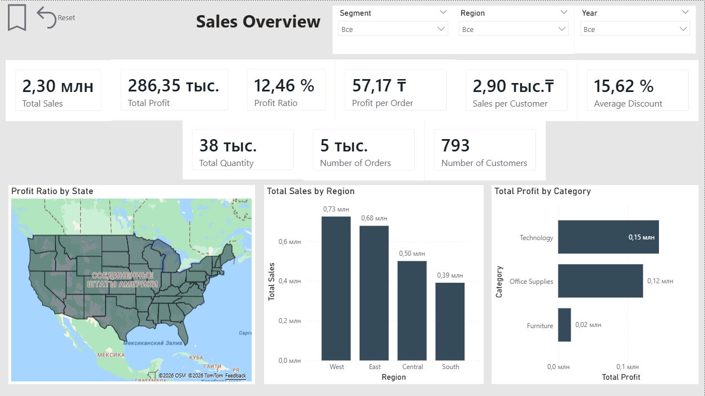
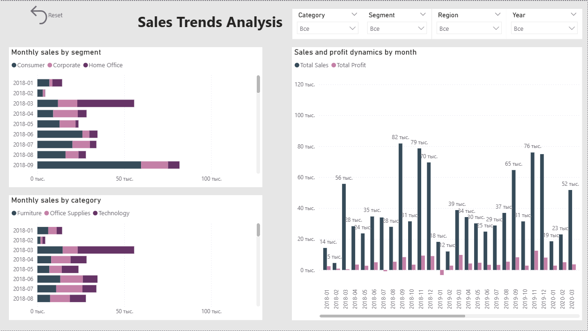
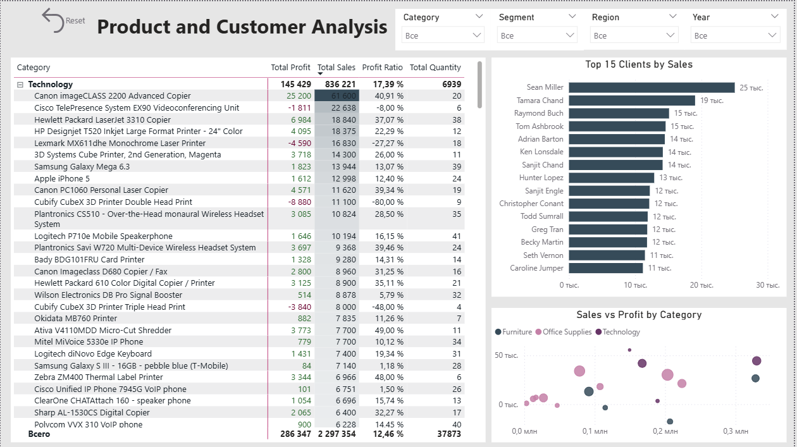
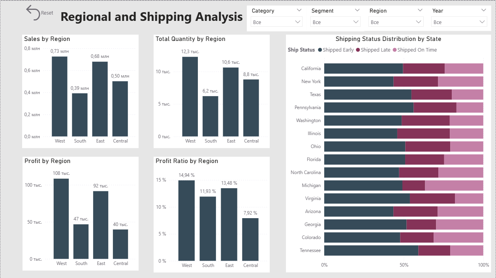

# Superstore Power BI Analysis

Interactive Power BI dashboard for sales, profit, customer, product, regional and shipping analysis.

## Dashboard Pages

1. Sales Overview
2. Sales Trends Analysis
3. Product and Customer Analysis
4. Regional and Shipping Analysis

## Key Metrics

- Total Sales
- Total Profit
- Profit Ratio
- Profit per Order
- Sales per Customer
- Average Discount
- Total Quantity
- Number of Orders
- Number of Customers

## Features

- Interactive slicers
- Synchronized filters
- Reset filters button
- Conditional formatting
- Data labels
- Enhanced tooltips
- Top 15 customer analysis
- Geographic analysis
- Shipping status analysis

## Tools

- Power BI Desktop
- Power Query
- DAX
- GitHub

## Dashboard Preview

### Sales Overview

### Sales Trends

### Product and Customer Analysis

### Regional and Shipping Analysis

## Files

- `Superstore_Management_Report (github).pbix`
- `Superstore_Management_Report (github).pdf`
